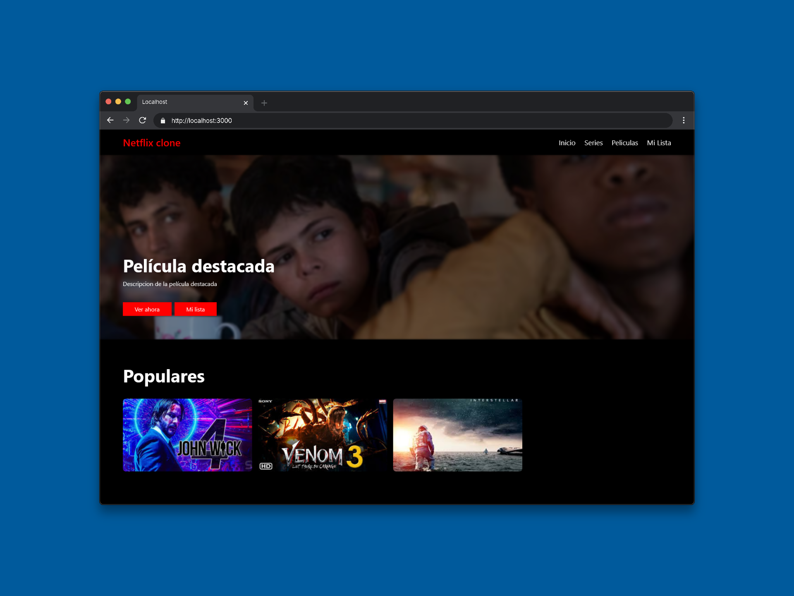

# 🏆 WorldSkills Preselección 2025 – 🎯 Clasificación Nacional en Tecnologías Web

[Ver Competencia Anterior (Regional)](https://github.com/AndresGutierrezHurtado/worldskills-regional-2025)

Este repositorio reúne todo el trabajo que desarrollé durante mi participación en la **competencia de preselección WorldSkills Colombia 2025**, en la habilidad **17 - Tecnologías Web**, donde competí contra **25 participantes regionales** de todo el país por el cupo para representar a Colombia en la **competencia nacional**.

Esta fase de preselección fue desarrollada en **un solo día con una duración de 2 horas**, lo que requirió máxima eficiencia, preparación técnica excepcional y capacidad de adaptación bajo presión extrema.

Aquí encontrarás las **dos pruebas completas entregadas** (Frontend y Backend), los **recursos utilizados** y los **proyectos desarrollados**, demostrando un enfoque técnico riguroso, disciplina constante y soluciones optimizadas que me permitieron destacar entre los mejores del país.



---

## 🏅 Contexto y Preselección WorldSkills Colombia 2025

La **preselección nacional WorldSkills Colombia 2025** es la fase más **exigente y competitiva** del proceso de selección. En esta etapa, los **ganadores regionales** de todo el país se enfrentan para obtener el derecho a representar a su regional en la **competencia nacional**, bajo estándares de calidad internacional.

### Datos Clave:

-   **Participantes**: 25 competidores de todo Colombia
-   **Duración**: 2 horas de desarrollo intensivo
-   **Modalidad**: Prueba de Frontend y Backend simultáneo
-   **Representación**: CEET (Centro de Electricidad, Electrónica y Telecomunicaciones) - SENA

### Exigencia y Desafíos Técnicos:

-   **Tiempo limitado**: máxima eficiencia en desarrollo
-   **Presión**: entorno de alta competitividad
-   **Velocidad sin sacrificar calidad**
-   **Capacidad de adaptación** a requerimientos cambiantes
-   **Dominio técnico** en múltiples tecnologías

### Importancia de la Preselección:

-   **Filtro de excelencia**: solo los 6 mejores avanzan a la competencia nacional
-   **Evaluación internacional**: bajo parámetros de WorldSkills
-   **Reconocimiento nacional**: validación del talento técnico colombiano
-   **Oportunidad de crecimiento**: acceso a competencias de mayor nivel

---

## 📁 Estructura del Repositorio

```bash
worldskills-preseleccion-2025/
├── prueba-frontend/                                # Prueba Frontend - Netflix Clone
│   ├── assets/                                     # CSS, JS, imágenes y videos
│   ├── docs/                                       # Documentación del proyecto
│   └── index.html                                  # Página principal
│
├── prueba-backend/                                 # Prueba Backend - Sistema de Gestión
│   ├── assets/                                     # CSS e imágenes del sistema
│   ├── server/
│   │   ├── core/                                   # Funciones core del sistema
│   │   ├── functions/                              # Lógica de autenticación y CRUD
│   │   ├── autoload.php                            # Carga automática de clases
│   │   └── database.sql                            # Estructura de base de datos
│   ├── dashboard.php                               # Panel administrativo
│   ├── catalog.php                                 # Catálogo público
│   ├── edit.php                                    # Edición de películas
│   ├── view.php                                    # Vista detallada
│   ├── delete.php                                  # Confirmación de eliminación
│   ├── index.php                                   # Página de inicio/login
│   └── README.md                                   # Documentación de instalación
│
├── docs/                                           # Testimonios y evidencias
│   └── testimonios/                                # Audios de profesores y evaluadores
│
└── README.md                                       # Archivo principal de documentación
```

---

## 🎯 Pruebas de la Competencia

### Prueba Frontend - Netflix Clone

Esta prueba evaluó las habilidades de desarrollo frontend con un enfoque en la recreación de una interfaz moderna y responsiva:

-   **HTML Semántico**: Estructura limpia y accesible
-   **CSS Responsivo**: Diseño adaptable a múltiples dispositivos
-   **JavaScript Interactivo**: Funcionalidad de modal y reproducción de videos
-   **UX/UI Moderna**: Interfaz inspirada en Netflix con navegación intuitiva
-   **Optimización de Recursos**: Carga eficiente de imágenes y videos

**Características destacadas:**

-   Header con navegación completa
-   Sección hero con película destacada
-   Grid de películas populares
-   Modal para reproducción de trailers
-   Diseño completamente responsivo

### Prueba Backend - Sistema de Gestión de Películas

Esta prueba evaluó las competencias en desarrollo backend y gestión de datos:

-   **Separación de responsabilidades**: Organización clara entre lógica, presentación y acceso a datos
-   **Base de Datos Relacional**: Gestión eficiente de datos
-   **Sistema de Autenticación**: Roles de usuario y administrador
-   **CRUD Completo**: Operaciones de creación, lectura, actualización y eliminación
-   **Interfaz Administrativa**: Panel de gestión intuitivo

**Funcionalidades implementadas:**

-   Login con roles diferenciados (admin/user)
-   Dashboard administrativo completo
-   Gestión de películas con imágenes
-   Catálogo público responsivo
-   Sistema de categorías por género
-   Validaciones de seguridad

---

## 🎙️ Testimonios

Durante la competencia, recibí reconocimiento directo de los **profesores evaluadores** y **coordinadores técnicos** de WorldSkills Colombia por la calidad de mi trabajo y mi desempeño bajo presión.

### 🎯 Reconocimientos

Estos testimonios fueron grabados durante y después de la competencia, capturando las impresiones directas de los evaluadores sobre mi desempeño técnico y competitivo.

#### 🎙️ Audio 1 - Evaluación Inicial del Proyecto

**📋 Contexto:** El instructor que me acompañó durante la prueba destacó la solidez de los primeros resultados obtenidos y la manera en que organicé el desarrollo desde el inicio.

[Descargar el audio](https://github.com/AndresGutierrezHurtado/worldskills-preseleccion-2025/raw/refs/heads/main/docs/testimonios/audio-0.mp3)

---

#### 🎙️ Audio 2 - Opinion a cerca del rendimiento durante la prueba

**📋 Contexto:** En este testimonio, el instructor resaltó mi rapidez, el dominio técnico demostrado y la calidad pulida del trabajo desarrollado en tiempo limitado.

[Descargar el audio](https://github.com/AndresGutierrezHurtado/worldskills-preseleccion-2025/raw/refs/heads/main/docs/testimonios/audio-1.mp3)

---

#### 🎙️ Audio 3 - Análisis post calficacion

**📋 Contexto:** El experto nacional de WorldSkills compartió su valoración sobre el proyecto, destacando la estructura técnica implementada y el nivel alcanzado frente a los demás competidores.

[Descargar el audio](https://github.com/AndresGutierrezHurtado/worldskills-preseleccion-2025/raw/refs/heads/main/docs/testimonios/audio-2.mp3)

---

#### 🎙️ Audio 4 - Evaluación Final y Reconocimiento

**📋 Contexto:** En la conclusión de la prueba, el experto nacional reconoció que fui uno de los pocos competidores en completar satisfactoriamente todos los ejercicios, resaltando mi

[Descargar el audio](https://github.com/AndresGutierrezHurtado/worldskills-preseleccion-2025/raw/refs/heads/main/docs/testimonios/audio-3.mp3)
