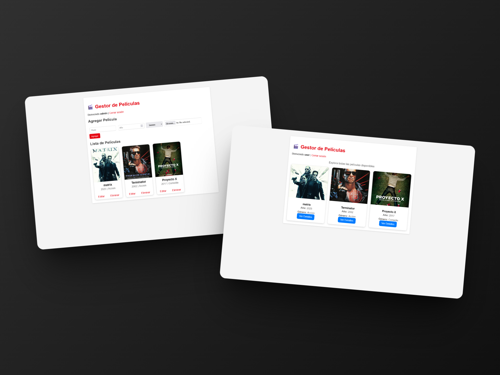

# 🖥️ Prueba Backend - Gestión de Películas en PHP

[🔙 Volver al inicio](../README.md)

[📄 Ver prueba](./docs/02-WSPRE2025_TP17_Backend.pdf)

Esta prueba tenía como objetivo desarrollar un backend en **PHP puro**, aplicando buenas prácticas de organización y modularidad en el código, para gestionar el flujo de autenticación y la administración de películas.

### ✅ Resultado

El desarrollo de esta prueba me permitió entregar un backend que **destacó frente a los demás por su estructura clara, organizada y funcional**, logrando una base más robusta y limpia en comparación con pruebas anteriores.

El único aspecto que afectó mi calificación fue **no haber implementado correctamente la validación de sesión y protección de rutas**, lo que me hizo perder varios puntos.

Aun así, considero que el resultado fue sobresaliente y plenamente alineado con lo solicitado:

-   La implementación fue **sólida y mejor estructurada** que en pruebas previas.
-   El CRUD de películas funcionó sin inconvenientes.
-   Se logró una separación clara entre la lógica del servidor y las vistas.
-   La organización modular permitió mayor escalabilidad y facilidad de mantenimiento.



---

## 📋 Descripción del Proyecto

El proyecto se construyó siguiendo una arquitectura sencilla pero bien organizada, con separación entre la lógica del servidor, las funciones específicas y las vistas.

Se implementaron características como:

-   **Autenticación (login/logout)**
-   **Gestión de películas (CRUD)**
-   **Manejo de sesiones**
-   **Mensajes de retroalimentación al usuario (alertas, redirecciones, etc.)**
-   **Estructura modular y reutilizable**

---

## 🛠️ Tecnologías Utilizadas

-   **PHP 8.2**: Lenguaje principal del backend
-   **MySQL (XAMPP)**: Base de datos relacional
-   **HTML5 / CSS3 / JS**: Vistas y componentes del lado del cliente
-   **Vanilla PHP Autoload**: Para organizar dependencias y cargar funciones

---

## 🏗️ Estructura del Proyecto

```
prueba-backend/
├── server/
│   ├── autoload.php                        # Carga automática de clases y dependencias
│   ├── database.sql                        # Script de creación de la base de datos
│   ├── core/                               # Configuración de DB y funciones generales
│   │   ├── database.php                    # Conexión a la base de datos
│   │   ├── response.php                    # Funciones de respuesta HTTP
│   │   ├── session.php                     # Manejo y validación de sesiones
│   │   └── validations.php                 # Funciones de validación
│   └── functions/
│       ├── auth/                           # Lógica de autenticación
│       │   ├── login.php                   # Función de inicio de sesión
│       │   └── logout.php                  # Función de cierre de sesión
│       └── movies/                         # Funciones CRUD para películas
│           ├── create.php                  # Crear nueva película
│           ├── update.php                  # Actualizar película existente
│           └── delete.php                  # Eliminar película
├── assets/                                 # Estilos, scripts e imágenes
│   ├── css/
│   │   └── styles.css                      # Estilos principales
│   └── imagenes/
│       ├── movies/                         # Imágenes de películas
│       │   ├── default.png
│       │   ├── 1.png
│       │   └── 2.png
│       ├── matrix.jpg                      # Imagen de ejemplo
│       └── terminator.jpg                  # Imagen de ejemplo
├── docs/                                  
│   └── 02-WSPRE2025_TP17_Backend.pdf       # Documentación de la prueba backend
├── index.php                               # Página principal
├── dashboard.php                           # Panel de administración
├── catalog.php                             # Catálogo de películas
├── view.php                                # Vista detallada de película
├── edit.php                                # Formulario de edición
├── delete.php                              # Confirmación de eliminación
└── README.md                               # Documentación del proyecto
```
